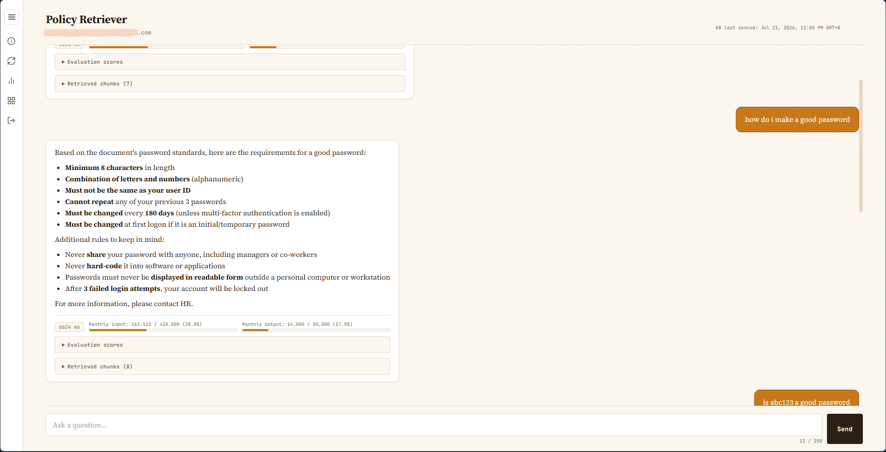

# AWS-RAG-GRC — Policy Retriever

A corporate RAG (Retrieval-Augmented Generation) system that lets employees ask natural-language questions about company policy documents stored in Google Drive — with real authentication, live AI-response evaluation, per-user cost governance, and a custom analytics dashboard. Built entirely on serverless AWS.



## Why this project

Most RAG demos stop at "retrieve chunks, generate an answer." This one goes further into what a real internal deployment actually needs: who's allowed to use it, how good the answers actually are, what it costs, and whether any one person is quietly burning through the budget. Every one of those concerns became a real engineering problem here, not just a checkbox.

## Architecture

```
Google Drive (source documents)
        │
        ▼
Amazon Bedrock Managed Knowledge Base (Google Drive connector, OAuth 2.0)
        │
        ▼
Query Lambda ──► Claude Sonnet (answer generation)
        │    ──► Amazon Nova Lite (answer evaluation)
        │    ──► DynamoDB (per-user live token budget + history)
        │    ──► S3 (session logs + structured analytics records)
        │
        ▼
API Gateway (HTTP API, Cognito JWT-authorized)
        │
        ▼
Frontend (S3 + CloudFront): index.html — chat UI with Cognito login

Separately:
S3 (analytics/date=YYYY-MM-DD/*.json)
        │
        ▼
AWS Glue (crawler → schema catalog)
        │
        ▼
Amazon Athena (SQL views: interactions, top users, cost, quality score, out-of-scope activity)
        │
        ▼
Dashboard Lambda (runs Athena queries, caches in DynamoDB, admin-group-gated)
        │
        ▼
dashboard.html — admin-only usage analytics
my-usage.html  — personal usage view for any logged-in user
```

## Key features

- **Real authentication** — Amazon Cognito (SRP auth flow), not a placeholder login. Session-aware, per-user.
- **Live answer evaluation** — every response is scored by a second model (Nova Lite) across three independent dimensions:
  - **Faithfulness** — is the answer grounded in retrieved context, or hallucinated?
  - **Answer Relevance** — did it actually address the question?
  - **Context Relevance** — did retrieval pull precise, relevant chunks, or noise?
- **Corporate-safe responses** — no blunt "I don't know." Genuine answers get a contact line appended; out-of-scope questions get a soft, professional redirect instead of a flat refusal.
- **Out-of-scope filtering** — questions the KB genuinely can't answer are tagged and excluded from quality metrics, so adversarial or off-topic queries can't quietly drag down the reported answer quality.
- **Per-user cost governance** — every user gets their own monthly input/output token cap, enforced server-side (not just a UI warning) — once a user crosses 80% of their allowance, further queries are blocked until the next month.
- **Full traceability** — every answer shows its retrieved source documents, linked back to the original Google Drive file, plus a personal query history.
- **Admin analytics dashboard** — weekly/monthly interaction volume, top users, cost trends, cumulative answer-quality score, and out-of-scope activity — built entirely on Athena + Lambda + Chart.js, at zero additional cost (no BI tool license required).
- **Group-enforced admin access** — the dashboard is gated both in the frontend (hidden) and the backend (API-level Cognito group check), so it's a real security boundary, not just a hidden button.


## Tech stack

| Layer | Service |
|---|---|
| LLM (generation) | Claude (Amazon Bedrock) |
| LLM (evaluation) | Amazon Nova Lite |
| Retrieval | Amazon Bedrock Managed Knowledge Base (Google Drive connector) |
| Compute | AWS Lambda (Python) |
| Auth | Amazon Cognito |
| API | Amazon API Gateway (HTTP API) |
| Storage | Amazon S3 |
| Live counters | Amazon DynamoDB |
| Analytics catalog | AWS Glue |
| Analytics queries | Amazon Athena |
| Hosting | S3 + CloudFront |
| Frontend | Vanilla HTML/CSS/JS, Chart.js |

## Repo structure

```
frontend/                    Chat UI, admin dashboard, personal usage page
backend/                     Lambda functions
infrastructure/
  athena_views/               SQL view definitions for the analytics pipeline
  iam_policies/                IAM policy JSON for each Lambda's execution role
docs/
  architecture.md             Fuller write-up of the system design
```

> **Note:** all API endpoints, resource names, and IDs in this repo are placeholders (`XXXXXX`) — this is a real, deployed system, and live credentials/endpoints have been removed before publishing.

## Notable engineering challenges

A selection of real problems hit and solved during the build (see `docs/architecture.md` for the full list):

- **Undocumented Managed KB API shape** — `retrieve` required the newer `managedSearchConfiguration` field instead of the documented `vectorSearchConfiguration`, since Managed Knowledge Base is a very recent Bedrock feature.
- **Stale SDK in the Lambda runtime** — the built-in boto3 didn't recognize the new API parameter; resolved with a custom Lambda layer.
- **Hive partition/column collision** — an analytics JSON field named `date` collided with the `date=` S3 partition key Glue derives automatically, breaking Athena with a cryptic "duplicate columns" error.
- **Silent quality-metric distortion** — recognized that out-of-scope or adversarial queries would unfairly tank the genuine answer-quality score, and re-architected the evaluation pipeline to tag and exclude them rather than just accept the noise.
- **Enforcing "admin-only" as a real boundary** — a frontend-only check is trivially bypassable; the dashboard's protection required an independent backend check against the Cognito JWT's group claim.
- **7-day OAuth refresh token expiry** — Google's Testing-mode OAuth apps expire refresh tokens weekly, requiring either a manual token-refresh process or full app verification to eliminate.

## License

MIT — see `LICENSE`.
